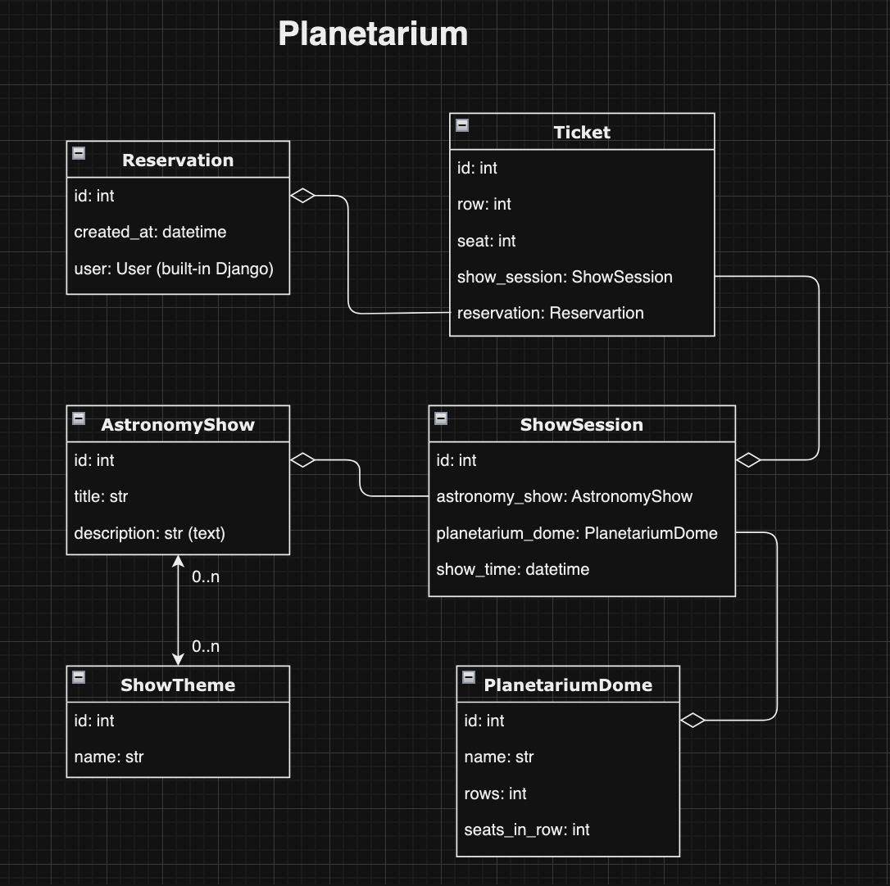
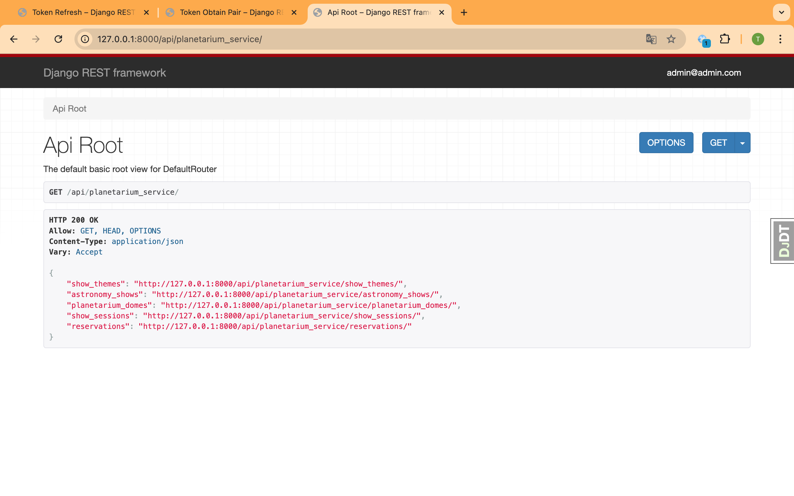
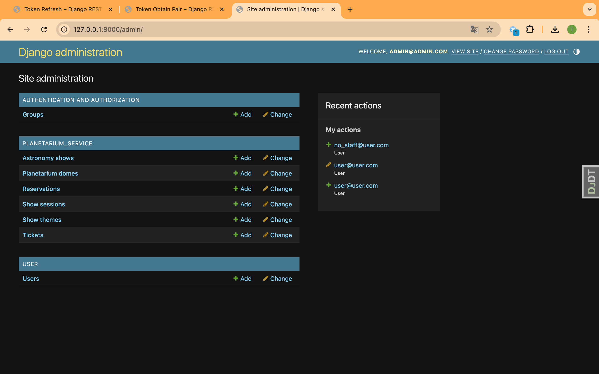
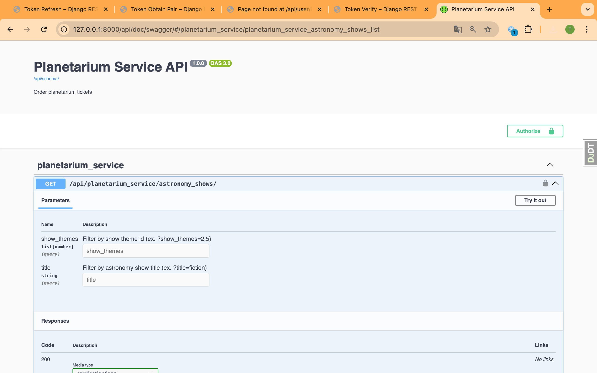
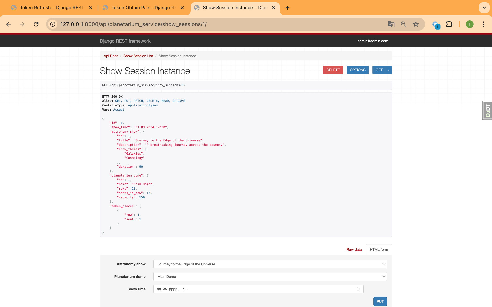

# Planetariun API Service

### This is an API service written on DRF, that allows you to management:
- content ,
- ordering tickets,
for planetariums with different user permissions.

## DB Structure



## Access to service

### Test user with status: is_staff=True
### `username:` `user@user.com`

### `password:` `UserTest2024`


### Test user with status: is_staff=False
### `username:` `no_staff@user.com`

### `password:` `UserNoStaff2024`

## Installing / Getting started

### Python3 must be already installed


## Installing using GitHub

Install PostgreSQL and create db

```bash
git clone https://github.com/TarasFirst/planetariun_api_service.git
cd planetariun_api_service
python -m venv venv
source venv/bin/activate
pip install -r requirements.txt
```

## Create .env file in planetariun_api_service/ and replace all "value" for yours own values:

POSTGRES_PASSWORD=value
POSTGRES_USER=value
POSTGRES_DB=value
POSTGRES_HOST=value
POSTGRES_PORT=5432
PGDATA=/var/lib/postgresql/data
SECRET_KEY="value"
ACCESS="private_access"


## Run with Docker

Docker should be installed

```bash
docker-compose build
docker-compose up
docker-compose exec planetariun_api_service python manage.py createsuperuser
```
### Set name and password to superuser


```bash
docker-compose exec planetariun_api_service python manage.py loaddata data_planet.json
```

## Getting Access

- Access token via `/api/user/token/`


## Features

- JWT authenticated `/api/user/` namespace
- Admin panel `/admin/` 
- Documentation is located at `/api/doc/swagger/` and `/api/doc/redoc/`


## Via namespace `api/planetarium_service/`

- Creat, change and remove:
  * show themes;
  * astronomy shows with different show themes;
  * planetarium domes;
  * show sessions;
- Filtering astronomy shows and show sessions;
- Managing reservations and tickets;

### Some pages








